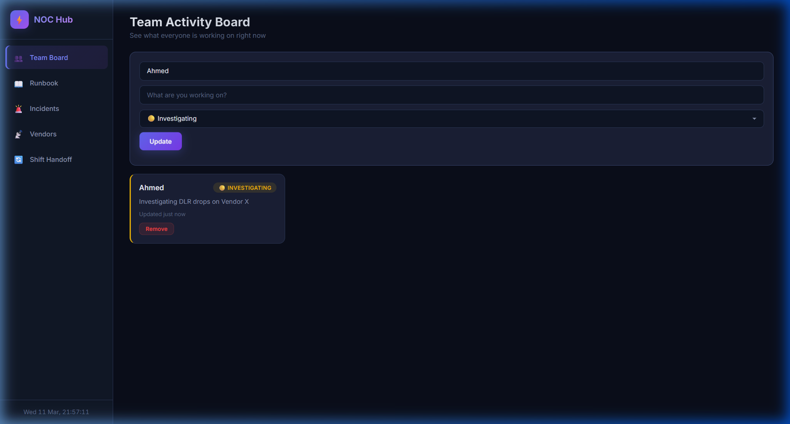
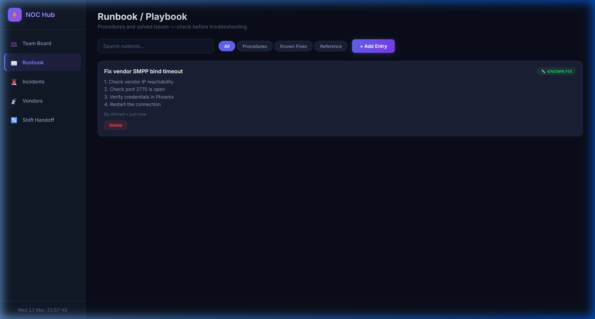
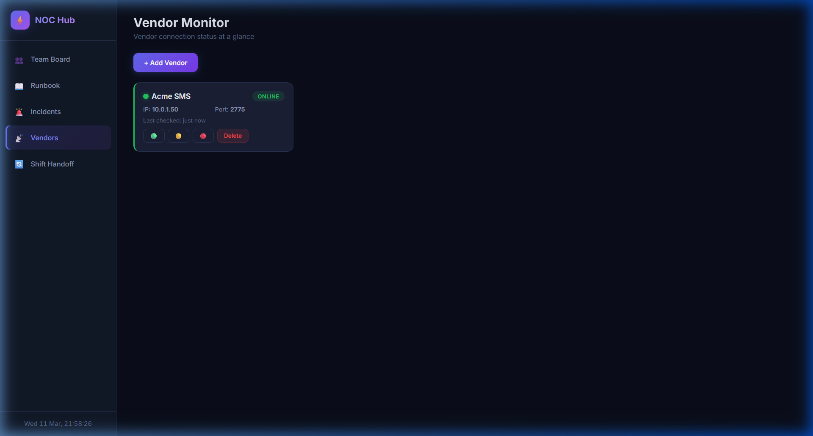
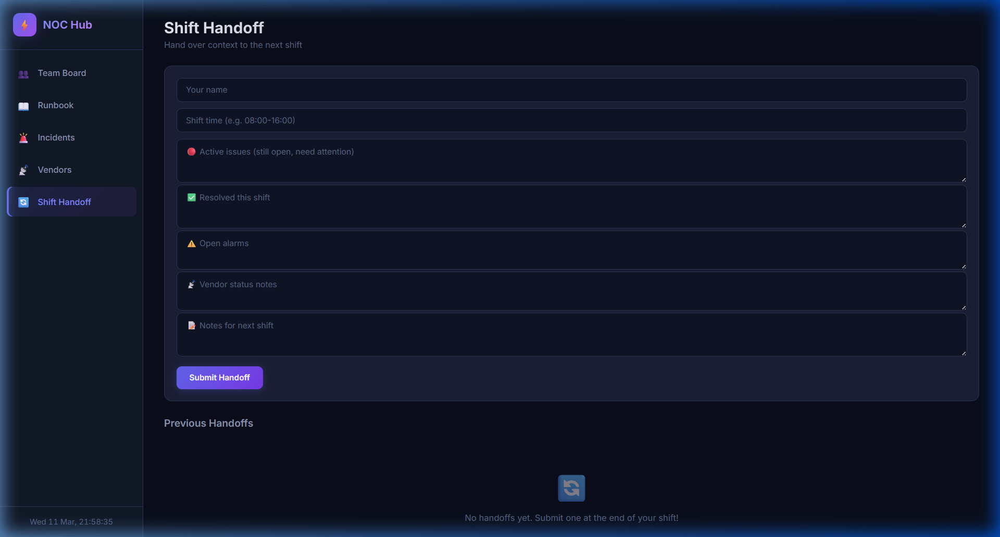

<div align="center">
  

  <h1>⚡ NOC Team Hub</h1>
  <p><strong>A centralized workspace for Network Operations Centers to manage shifts, incidents, vendors, and knowledge.</strong></p>
</div>

<hr>

## 🚀 Overview

The **NOC Team Hub** is a lightweight, dark-themed web application designed specifically for NOC teams. It solves the chaos of lost shift context, disjointed vendor tracking, and repeated mistakes by bringing the team's core workflows into one shared pane of glass.

Built with **React, Socket.io, Node.js, and SQLite**, it features **"Zero-Manual-Entry"** automations that handle the busywork so engineers can focus on fixing issues.

## ✨ Features

### 👥 1. Team Activity Board (Live Alerts & One-Click Claim)
Know exactly what everyone is working on in real-time. 
- **Automation:** If a Vendor goes down, a flashing red "🚨 LIVE ALERT" banner appears here. Engineers click **"🤚 I'm on it"** to auto-assign the issue to themselves instantly.
<p align="center"></p>

### 📖 2. Runbook / Playbook (Auto-Suggested Fixes)
A shared knowledge base for procedures and known fixes. 
- **Automation:** When a Live Alert fires on the Team Board, the system automatically finds the specific playbook for that vendor and suggests the fix directly beneath the alarm, so engineers don't have to search.
<p align="center"></p>

### 🚨 3. Incident Log (Auto-Logged Resolutions)
Track outages, log root causes, and document the fix.
- **Automation:** When you resolve an incident on this tab, you are asked for the fix. The system then automatically converts your fix into a new Runbook/Playbook entry organically.

### 📡 4. Vendor Monitor (Automated Pinging)
A glanceable dashboard for your upstream connections and B2B partners.
- **Automation:** A background script pings the Vendor IPs and checks SMPP ports every 60 seconds. If a connection drops, the dashboard updates automatically—no manual checking required.
<p align="center"></p>

### 🔄 5. Shift Handoff
Never lose context between shift changes. A structured form for declaring active issues, resolved incidents, open alarms, and specific notes for the next shift.
<p align="center"></p>

---

## 🛠️ Tech Stack

- **Frontend:** React (Vite), Tailwind CSS, Socket.io-client
- **Backend:** Node.js, Express, Socket.io
- **Database:** sql.js (Pure JavaScript SQLite — file-backed)
- **Design:** Modern dark mode, custom UI/UX for operations centers.

## 💻 How to Run Locally

You can run this project locally on your machine in under a minute.

1. **Clone the repo:**
   ```bash
   git clone https://github.com/TonyDoesEngineering/noc-hub.git
   cd noc-hub
   ```

2. **Install dependencies:**
   ```bash
   npm install
   cd client
   npm install
   cd ..
   ```

3. **Start the backend server:**
   ```bash
   node server.js
   ```

4. **Start the frontend server (in a new terminal):**
   ```bash
   cd client
   npm run dev
   ```

5. **Open in browser:**
   Open [http://localhost:5173](http://localhost:5173)

> *The database file (`noc-hub.db`) will be automatically created in the root directory.*

## 📈 Future Roadmap

As an ongoing project, planned features include:
- **Authentication:** Individual user logins.
- **WebSockets:** Real-time synchronized updates across all connected clients without refreshing.
- **Alerting Integration:** Email or webhook alerts for P1 Incidents.
- **Metrics Dashboard:** Visual charts for incident frequency and DLR rates.
